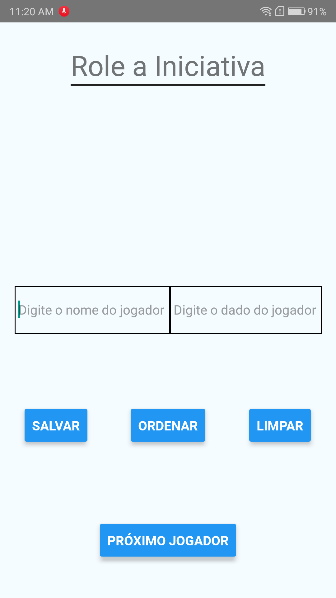
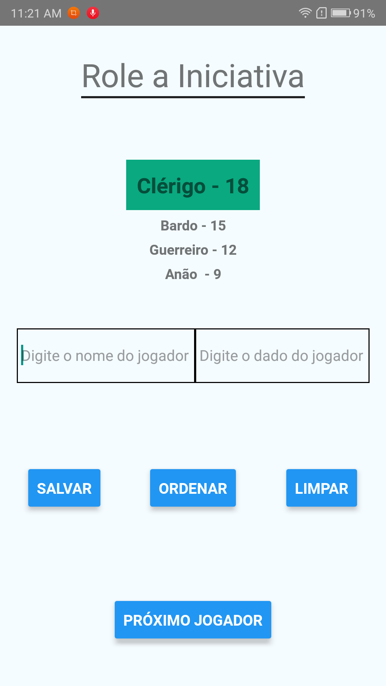
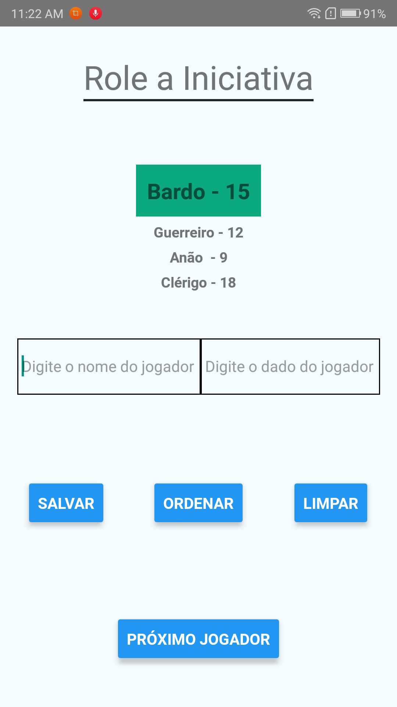
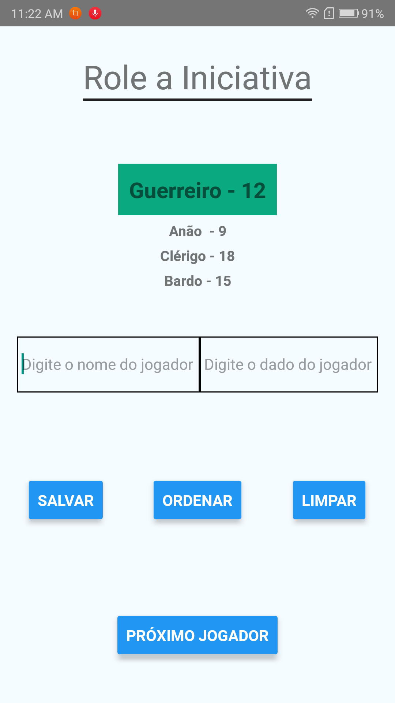

### App para rolar iniciativas para RPG

App feito com React Native na intensão de ajudar ao mestre a organizar a ordem de iniciativa dos jogadores em uma mesa de RPG.

#### Sem os jogadores cadastrados

#### Com os jogadores cadastrados

#### Ordenando os jogadores cadastrados

PS. A ordanação é do número maior para o menor.

#### Exibindo o próximo jogador para sua ação

PS. Para isso clique no botão `Próximo Jogador`.

Para cadastrar um jogador basta colocar no nome do jogador e no lado o valor do dado e clicar em `Salvar`.